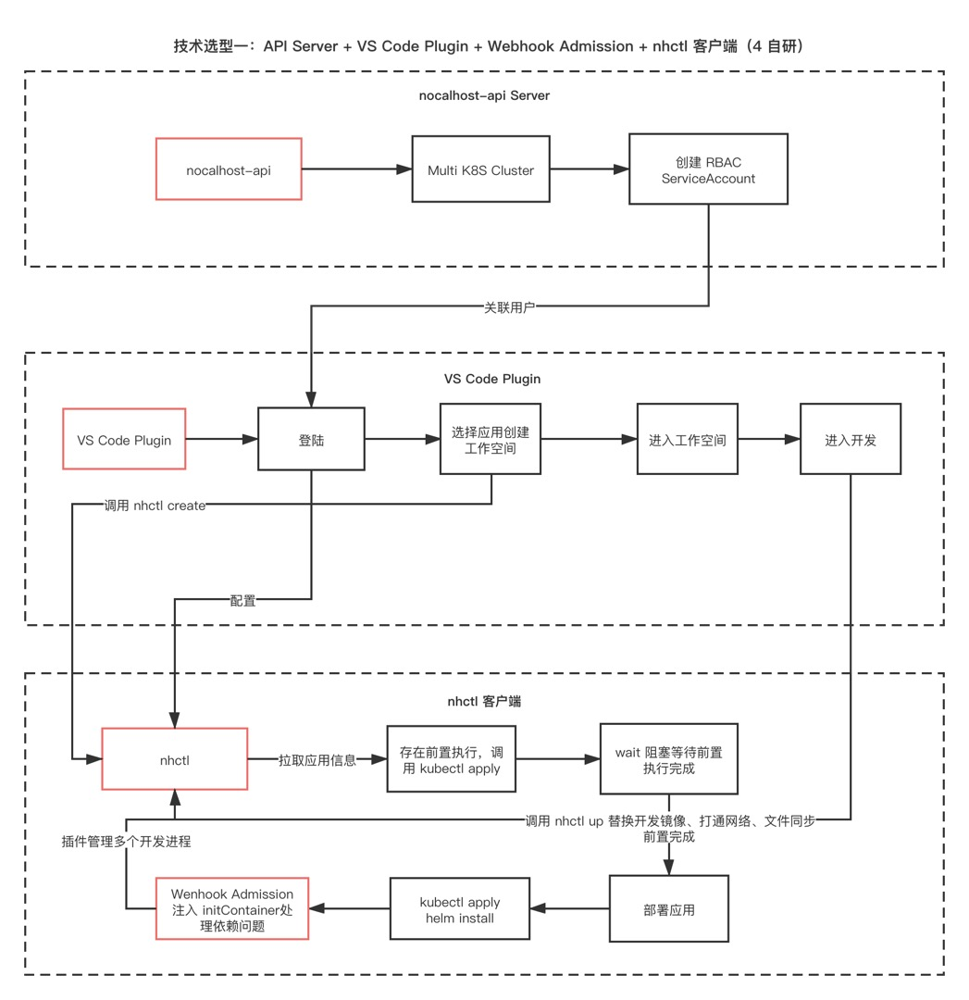

# Nocalhost
## 解决什么问题？
随着应用的微服务数量越来越多，团队会使用 `容器化` 技术来屏蔽微服务的环境差异。

而对于使用 Kubernetes 作为基础环境的系统来说，他们的开发和调试变得越来越困难，主要体现在以下几点：

* 为了对某一个微服务进行开发，需要启动整个环境以及所有的微服务，对本机配置要求高，体验差；
* 开发人员往往只专注于自己负责的服务，随着服务和配置的不断迭代，本机启动`最新`且`完整`的开发环境越来越困难；
* 解决快速启动开发环境的问题，一定会使用容器化技术，那么将有两个选择：本地运行 Docker-compose 或 Kubernetes 集群；
* 解决了快速启动完整开发环境，调试将变得困难。每次代码改动，都需要 build 镜像 -> 推送镜像 -> 拉取镜像 -> 重建应用（Pod） 的流程，开发的循环反馈极慢；

## 如何解决？
Nocalhost 是基于云原生的开发环境，主要为用户提供以下能力：
* 为每一位团队成员快速创建基于 K8S Namespace 隔离的应用开发环境，开发调试互不影响；
* 云原生体验的微服务开发和调试：远端启动应用环境后，本机不再需要启动任何微服务，一切开发基于远端的 K8S 开发环境，无需重建 Docker 镜像，任何代码改动的影响将立即同步到对应远端的 Pod。
* 以 Sidecar 的方式解决服务依赖问题（业务端未实现 Try ，依赖的服务未启动导致自身无法启动）和服务启动周期的编排，例如实现以下启动顺序：Mysql (UP & Init) -> RabbitMQ (UP) -> Server A (UP) —> Server B (UP)

## 最终目标
Nocalhost 的最终目标是实现极致的开发体验：

* 登陆 Nocalhost VSCODE 插件；
* 选择应用并部署独立的开发环境；
* 部署完成，选择要开发的微服务组件；
* 自动克隆微服务项目代码到本地，编辑器内的改动自动同步到远端对应微服务容器内；
* 远端容器自动运行新的代码，改动实时生效；
* 如需调试，点击 VSCODE 调试按钮，自动与远端建立调试通道，接收调试信息；
* 微服务开发结束，可选销毁环境。

# Nocalhost 组成
## Web 端
Web 端提供应用管理、应用授权、集群管理、用户管理和应用-集群授权等功能。

## nhctl
nhctl 是运行在开发者本地的客户端，主要提供本地和远端集群的交互能力。

## VSCODE 插件
VSCODE 插件提供对远程开发环境的工作负载展示、进入开发环境和克隆项目代码的能力。

## 组件间的交互

# 构建
## nhctl
`go build cmd/nhctl/nhctl.go`

## Api
`go build cmd/nocalhost-api/nocalhost-api.go`

## Admission Webhook
在项目根目录运行：

`docker build -t nocalhost-admission-webhook:latest -f deployments/admission-install-job/webhook/Dockerfile .`

# 生成 API 文档
swag init -g cmd/nocalhost-api/nocalhost-api.go
访问地址：http://localhost:8080/swagger/index.html