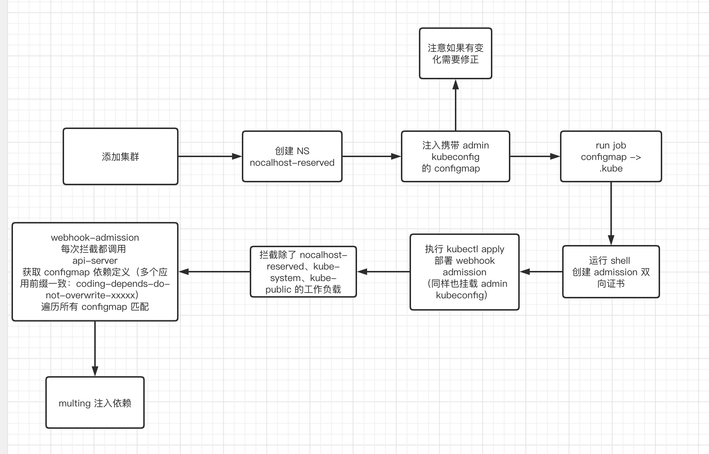

# Nocalhost-Dep
Nocalhost-Dep 项目为开发应用在 Kubernetes 集群安装提供依赖处理。

## 解决什么问题？
当应用的微服务使用 Manifest 的方式部署在 Kubernetes 集群时，无法控制这些微服务的启动顺序和依赖的问题。
一个典型的场景是：服务 A、服务 B 都依赖于 Mysql、Redis、RabbitMQ，当被依赖的这些服务可用时才能服务 A 和服务 B 才能够启动。
解决这个问题，通常是在被依赖的服务都处于 Running 时，手动删除服务 A 和服务 B 的 POD，重启解决。
除了像 Mysql 等所有服务都依赖的基础服务外，服务与服务之间还可能产生依赖关系，如果微服务数量非常多，那么梳理手动重启顺序将变得非常复杂且耗时。

## 如何解决
Nocalhost-Dep 使用与 Istio 注入 Sidecar 相同的技术选型，实现了 [Kubernetes Admission Webhook](https://kubernetes.io/zh/docs/reference/access-authn-authz/extensible-admission-controllers/)
。当新的应用部署到集群时，Nocalhost-Dep 会根据声明的依赖关系自动对工作负载注入 InitContainer Sidecar，
并在 InitContainer 内查询并等待被依赖服务直至启动完成，利用 InitContainer 的特性进而启动真正的业务容器，实现服务的依赖处理。
InitContainer 的原理是使用 [k8s-wait-for](https://github.com/groundnuty/k8s-wait-for) 实现。

## 安装
1. 创建 nocalhost-reserved 命名空间
   ```
   kubectl create ns nocalhost-reserved
   ```
2. 修改项目目录 `/deployments/dep-install-job/example/kube-configmap-example.yaml`，将内容替换为自己集群`管理员`的 `Kubeconfig` 配置
   ```
   修改完成后，在项目根目录执行
   kubectl apply -f deployments/dep-install-job/example/kube-configmap-example.yaml
   ```
3. 创建用户开发命名空间后，对命名空间打标签（注入 Sidecar 标记）
   ```
   kubectl label namespace {namespaceName} env=nocalhost
   ```
4. 为`用户开发空间` 的 default serviceAccount 授权`查看权限`（根据集群版本不同 default 可能默认无此权限）
   ```
   kubectl create rolebinding default-view \
        --clusterrole=view \
        --serviceaccount={namespace}:default \
        --namespace={namespace}
   ```
5. 应用 dep-install-job ，该 Job 将会自动安装 Admission Webhook
   ```
   在项目根目录下执行：
   kubectl create -f deployments/dep-install-job/installer-job.yaml
   ```
6. 查看安装状态
   ```
   $ kubectl get pods -n nocalhost-reserved
   NAME                                             READY   STATUS      RESTARTS   AGE
   admission-installer-th6fp-8jp44                  0/1     Completed   0          3m29s
   nocalhost-mutating-dependents-869c7c4769-8zp8q   1/1     Running     0          3m25s
   
   $ kubectl get svc -n nocalhost-reserved
   NAME                             TYPE        CLUSTER-IP       EXTERNAL-IP   PORT(S)   AGE
   nocalhost-sidecar-injector-svc   ClusterIP   172.16.255.156   <none>        443/TCP   3m50s
   ```
7. 手动 apply `bookinfo` 依赖的声明式依赖，apply 后，使用 nhctl 部署 Manifest 类型 `bookinfo` 观察结果。

```
apiVersion: v1
kind: ConfigMap
metadata:
  name: nocalhost-depends-do-not-overwrite-gernatekey
  namespace: nocalhost-reserved
data:
  nocalhost: |
    dependency:
      - name: ratings-v1
        type: deployment
        jobs:
        - "dep-job"
        pods:
        - "productpage"
      - name: productpage-v1
        type: deployment
        jobs:
        - "dep-job"
      - name: reviews-v1
        type: deployment
        pods:
        - "productpage"
```

# Admission-Webhook 执行步骤
